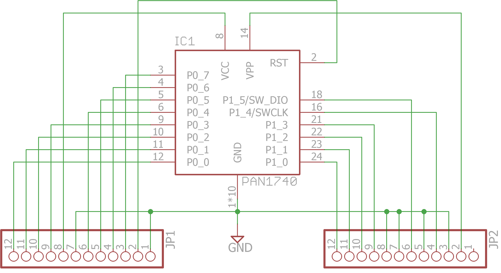

# pcb-breakout-pan1740
Pin breakout of the Panasonic PA1740 board to through-hole pin headers for prototyping.

##PCB Design software and addons used

1. Eagle 7.3.0: I use Standard but Light should still be able to open/modify the files.
2. PAN1740 library by [DIY modules](http://www.diymodules.org/eagle-show-library?type=usr&id=1012210994) (in repo as panasonic-pan1740.lbr)

##Images

This is the older revision 1 design. It has an error of some vias being below the antenna. Has been corrected in Revision 2.

##Schematic drawings
Images are exported from Eagle at 600dpi.

##Parts required

The PAN1740 module which can be bought from one of the online stores like [Mouser](http://www.mouser.sg/new/panasonic/panasonic-pan1740-ble-module/)
